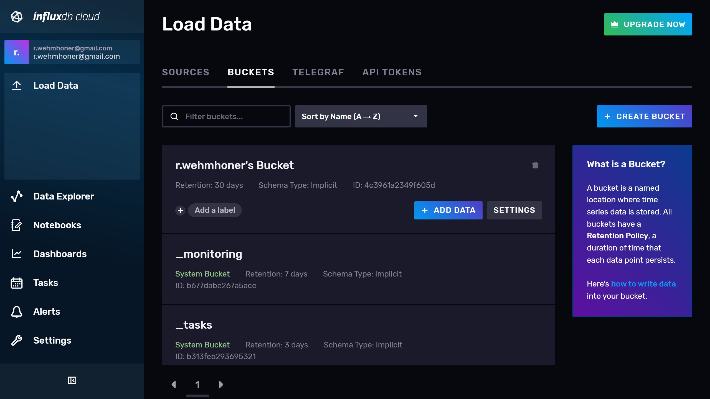
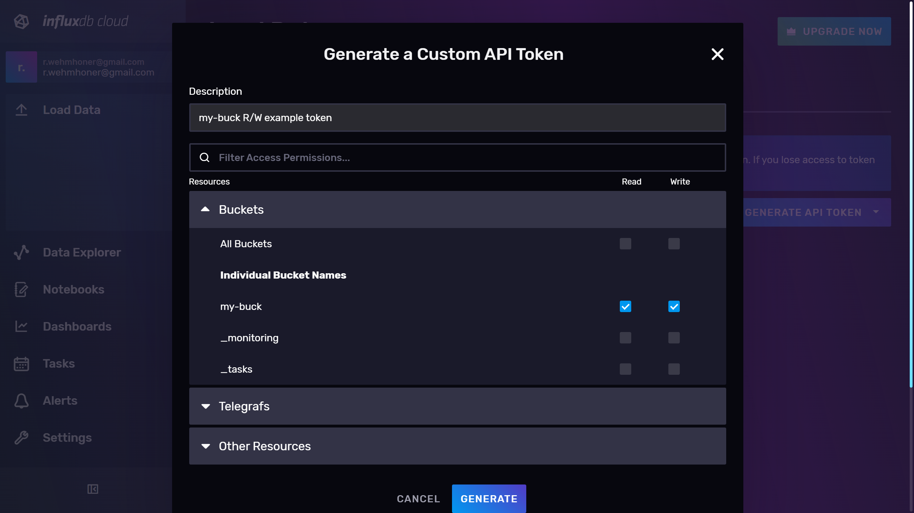
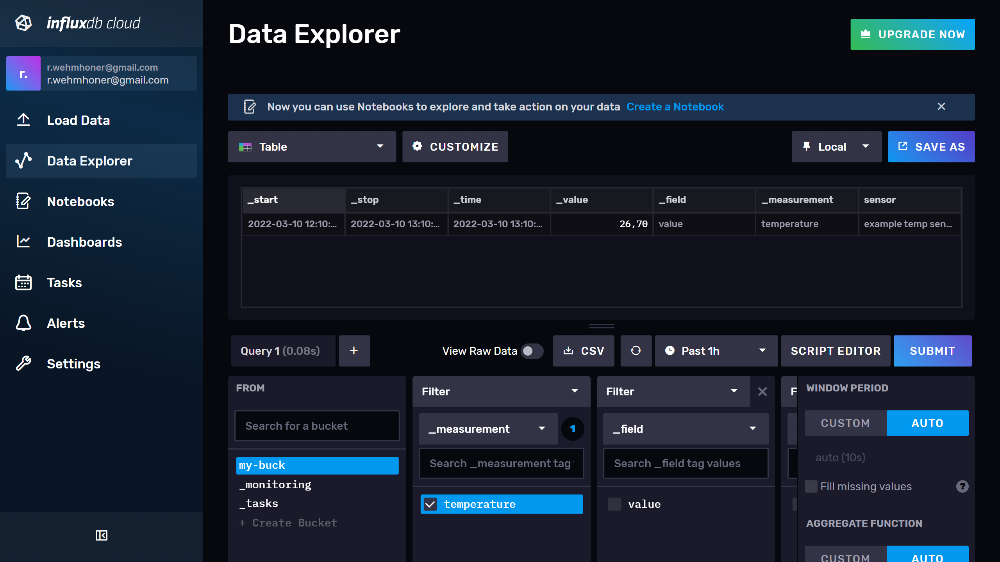
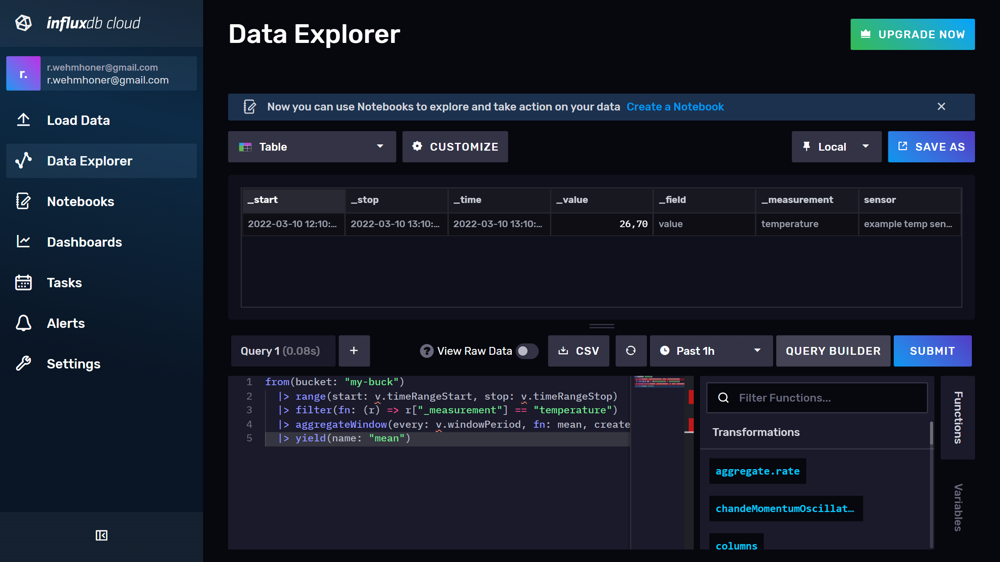

# TODOS

create tsconfig.json ?
best practices for API Tokens ?
Possible errors notes same as in iot center workshop

more abstract (how points looks etc.)

create repozitory with docker-compose and corresponding .ENV which can be started without any modifications

Query parameters more complex example?, documentation for flux... functions

everything will be online on github for easier testing troubleshooting
Explain point structure
Important query notes rename to something more accurate for this topic, but keep name that will stand out so nobody will skip this important topic.

dead link https://github.com/influxdata/influxdb-client-js/blob/7fc386c59e718dfb452fad915ff3cd561b697536/packages/core/src/query/flux.ts#L42

find reasonable usage for [queryRows](https://github.com/influxdata/influxdb-client-js/blob/master/examples/query.ts) add after Query parameters 

# setup influxdb

## create cloud influxdb account OR use local OSS influxdb instalation

### Cloud setup
register cloud https://cloud2.influxdata.com/signup
(select closest provider ?)

*Cloud account has many advanateges over OSS version ... todo*

### Local setup with docker

You need to have [Docker](https://www.docker.com/) running

<details>
<summary>for fast init create `docker-compose.yml` containing:</summary>

```yml
version: "3"
services:
  influxdb_v2:
    image: influxdb:latest
    ports:
      - "8086:8086"
    environment:
      - INFLUXD_HTTP_BIND_ADDRESS=:8086
      - DOCKER_INFLUXDB_INIT_MODE=setup
      - DOCKER_INFLUXDB_INIT_USERNAME=my-user
      - DOCKER_INFLUXDB_INIT_PASSWORD=my-password
      - DOCKER_INFLUXDB_INIT_ORG=my-org
      - DOCKER_INFLUXDB_INIT_BUCKET=my-buck
      - DOCKER_INFLUXDB_INIT_RETENTION=30d
      - DOCKER_INFLUXDB_INIT_ADMIN_TOKEN=my-token
    command: influxd --reporting-disabled
```
</details>


and call `docker-compose up -d`

influx should be running on http://localhost:8086/ with login, password, bucket, token etc. defined inside docker-compose.yml (for details see [docker hub influxdb docs](https://hub.docker.com/_/influxdb))

*bucket and token is already created, so step where we will create them can be skipped*

### Local setup binaries

go to [inflxudb downloads page](https://portal.influxdata.com/downloads/), select your platform and install binaries. Then run server with `influxd`. **Note that server is running inside your terminal and will be shuted down if you close terminal window.**
Proceed through onboarding on http://localhost:8086/ and create your local account.

*binaries can differ in behaviour details, if you want to have smooth experience, create free **influxdb cloud account***


# Creating bucket

[Login](https://cloud2.influxdata.com/login) into your influxdb ui. 

Go to Load data tab -> buckets.


Click crete bucket. Name your bucket and click create. Remember your bucket name, it will be important later.

*Buckets are where data is stored in influxdb, its equivalent in sql are databases*


Next stay in Load data tab and go to API Tokens sub tab and click **Generate API Token**. Name your api token, check read and write for your created bucket and click **generate**.

Save your token somewhere safe. If you lost or publicate your token, you can always invalidate it and create new one.

*API Keys is like your login information into influx db but for your program. They have also definde privileges what your program can do and what cannot for safety reasons*

# exiting libraries

There are many [influxdb clients](https://docs.influxdata.com/influxdb/v1.8/tools/api_client_libraries/), which can be used to build and connect your application to influxdb. In this tutorial we will go through basics of javsctipt client but feel free to explore other clients too.

TODO: blogpost for other libraries here

# Javsript client examples

## preparing js environment

prerequizites
  [node.js](https://nodejs.org/en/)
  yarn (with `npm install -g yarn` if npm installed)


create package.json

yarn add @influxdata/influxdb-client
yarn add -D ts-node typescript @types/node dotenv

add 
```json
  "scripts": {
    "start":"ts-node ./src/index.ts"
  },
```
<details>
<summary>package.json will look like this</summary>

```json
{
  "scripts": {
    "start": "ts-node ./src/index.ts"
  },
  "dependencies": {
    "@influxdata/influxdb-client": "^1.23.0"
  },
  "devDependencies": {
    "@types/node": "^17.0.21",
    "dotenv": "^16.0.0",
    "ts-node": "^10.7.0",
    "typescript": "^4.6.2"
  }
}
```
</details>


Now we have prepared our influxdb bucket, and API Token. It's also good to have ui opened so we can explore data there too.

create .ENV file and fill up your information in it. 
```
INFLUX_URL=
INFLUX_TOKEN=
INFLUX_ORG=
INFLUX_BUCKET=
```
*You want to keep your token safe, so add .ENV into your .gitignore so you won't accidentaly commit it public*

*This file is used by library dotenv and simulates passing values by environment. Feel free to use envirnment values instead if you know how to use it.*


## Code

### Load environment values

now we can create `index.ts` inside `src` directory and start adding code.

import and ensure all reuquired properties are set and create Influxdb object

```ts
import 'dotenv/config';
import { InfluxDB } from "@influxdata/influxdb-client";

const { INFLUX_URL, INFLUX_TOKEN, INFLUX_ORG, INFLUX_BUCKET, } = process.env;

if (!INFLUX_URL || !INFLUX_TOKEN || !INFLUX_ORG || !INFLUX_BUCKET) {
  process.stderr.write("Missing one or more environment values: INFLUX_URL, INFLUX_TOKEN, INFLUX_ORG, INFLUX_BUCKET\n")
  process.exit(1);
}

const db = new InfluxDB({ token: INFLUX_TOKEN, url: INFLUX_URL });
```

### Creating point

Each point consists of measurement, tags, fields and timestamp
measurement is used for...
tag ...
field ...
timestamp can differ in precision.

First we import Point and create one where we pass all information through method chaining
```ts
const point1 = new Point('temperature')
  .tag('sensor', 'example temp sensor tag')
  .floatField('value', 20 + Math.round(100 * Math.random()) / 10)
  .timestamp(new Date()) 
```
This point is just our client structure which can be printed out as line protocol or sent to influxdb by writeApi.

```ts
console.log(point1.toLineProtocol())
```

*Line protocol is string representation of point. [More in docs](https://docs.influxdata.com/influxdb/v1.8/write_protocols/line_protocol_tutorial/)*

### Write

To write first point we need to initialize write api
```ts
const writeApi = db.getWriteApi(INFLUX_ORG, INFLUX_BUCKET, 'ns');
```
*in this example we will use **ns** precision of unix like timestamp*

Now when we have data and writeApi ready we can finaly write into influxdb

```ts
writeApi.writePoint(point1)
```

this code won't necessary writes imidiately point into influxdb and if we want to ensure write was done we need to flush endpoint with `writeApi.flush();`

But for now we are done with writing points so we can close connection which also flushes existing write queue.

```ts
writeApi.close();
```

<details>
<summary>index.ts should by now look like this</summary>

```ts
import 'dotenv/config';
import { InfluxDB, Point } from "@influxdata/influxdb-client";

const { INFLUX_URL, INFLUX_TOKEN, INFLUX_ORG, INFLUX_BUCKET, } = process.env;

if (!INFLUX_URL || !INFLUX_TOKEN || !INFLUX_ORG || !INFLUX_BUCKET) {
  process.stderr.write("Missing one or more environment values: INFLUX_URL, INFLUX_TOKEN, INFLUX_ORG, INFLUX_BUCKET\n")
  process.exit(1);
}

const db = new InfluxDB({ token: INFLUX_TOKEN, url: INFLUX_URL });

const writeApi = db.getWriteApi(INFLUX_ORG, INFLUX_BUCKET, 'ns');

const point1 = new Point('temperature')
  .tag('sensor', 'example temp sensor tag')
  .floatField('value', 20 + Math.round(100 * Math.random()) / 10)
  .timestamp(new Date()) 

console.log(`writing point: ${point1.toLineProtocol()}`);

writeApi.writePoint(point1);

writeApi.close();
```

</details>

### Query

Now we can open ui and create query so we can see if we were successfull with our effort. 

Go to Data Explorer -> select bucket -> select measurement, change upper select to Table and click submit. We should see one point as seen in image.



Now click script editor



This is the query we used to get our data written in [flux language](https://docs.influxdata.com/flux)

*It's good practice to experiment with queries inside ui and then copy them and modify for application*

```
from(bucket: "my-buck")
  |> range(start: v.timeRangeStart, stop: v.timeRangeStop)
  |> filter(fn: (r) => r["_measurement"] == "temperature")
  |> aggregateWindow(every: v.windowPeriod, fn: mean, createEmpty: false)
  |> yield(name: "mean")
```

This code generated by query builder has a lot commands for this demo so we will remove some and replace variable values with static ones.

*Variables are those v.something expressions which are in this case used by query builder to manualy select data range or aggregateWindow*

For our example we will now keep just range to select data of our measurement from past 1 hour without aggregations *( we belive that we will query small data now :smile: )*

```
from(bucket: "my-buck")
  |> range(start: -1h)
  |> filter(fn: (r) => r["_measurement"] == "temperature")
```

now copy this to our code.

```ts
const query = `
  from(bucket: "my-buck")
    |> range(start: -1h)
    |> filter(fn: (r) => r["_measurement"] == "temperature")
`
```

get query api same way as we did with write api
```ts
const queryApi = db.getQueryApi(INFLUX_ORG);
```

now we can pass our query into query api and print them out
```ts
queryApi.collectRows(query)
  .then(data => console.log(
    data.map(x => JSON.stringify(x)).join("\n")
  ))
```

*As we can see, there's data passed in then and not directly returned by function. This concept is called promises and is very crucial when we want to wait for something or do something in parallel. Now it's good time to take course about promises anywhere and get back here. We will also use async/await keywords which are used by promises too*


Now comment out write code and execute our new code.
<details>
<summary>index.ts now</summary>

```ts
import 'dotenv/config';
import { InfluxDB, Point } from "@influxdata/influxdb-client";

const { INFLUX_URL, INFLUX_TOKEN, INFLUX_ORG, INFLUX_BUCKET, } = process.env;

if (!INFLUX_URL || !INFLUX_TOKEN || !INFLUX_ORG || !INFLUX_BUCKET) {
  process.stderr.write("Missing one or more environment values: INFLUX_URL, INFLUX_TOKEN, INFLUX_ORG, INFLUX_BUCKET\n")
  process.exit(1);
}

const db = new InfluxDB({ token: INFLUX_TOKEN, url: INFLUX_URL });

/*
const writeApi = db.getWriteApi(INFLUX_ORG, INFLUX_BUCKET, 'ns');

const point1 = new Point('temperature')
  .tag('sensor', 'example temp sensor tag')
  .floatField('value', 20 + Math.round(100 * Math.random()) / 10)
  .timestamp(new Date())

console.log(`writing point: ${point1.toLineProtocol()}`);

writeApi.writePoint(point1);

writeApi.close();
*/

const query = `
  from(bucket: "my-buck")
    |> range(start: -1h)
    |> filter(fn: (r) => r["_measurement"] == "temperature")
`

const queryApi = db.getQueryApi(INFLUX_ORG);

queryApi.collectRows(query)
  .then(data => console.log(
    data.map(x => JSON.stringify(x)).join("\n")
  ))
```

</details>

This is what our result should look like now. If you wrote multiple point you will have more lines of code, but in this case we have just one.
```
{"result":"_result","table":0,"_start":"2022-02-22T12:20:22.2022Z","_stop":"2022-02-22T12:20:22.2022Z","_time":"2022-02-22T12:20:22.2022Z","_value":22.7,"_field":"value","_measurement":"temperature","sensor":"example temp sensor tag"}
```

### Important query notes

We have now two problems with our code:
  1) we are sending all data from influxdb in raw points
  2) we are loading all data received from influxdb in memory

Loading all data in memory can be desired and can mean no issue, sending all points as is from influxdb can be slow and dangerous fun.

For this reason there's flux function called [**aggregateWindow**](https://docs.influxdata.com/flux/v0.x/stdlib/universe/aggregatewindow/). Yes that's that function we have removed from our first query, so now paste it back with some static value as every parameter.

```ts
const query = `
  from(bucket: "my-buck")
    |> range(start: -1h)
    |> filter(fn: (r) => r["_measurement"] == "temperature")
    |> aggregateWindow(every: 1m, fn: mean, createEmpty: false)
`
```

**aggregateWindow** takes data and split them into so called windows and applies function *fn* on them and creates new points this way.

*Now there can be wrote as many points as possible in our last hour. There can be point every second or there can be point every nanosecond. When we have one device that sends one point every second we can be certain than there's no more points than we want but when we will scale up and use multiple devices that sends data in non-periodic way, it's hard to predict how many point's there will be.*

### Query parameters

*Passing params can be dangerous if you don't escape them properly. Luckily there are tagged template which will do escaping and transformations for us*

If we want changeable time range we can use `fluxDuration` in `flux` tagged template for that.

```ts
import {
  flux,
  fluxDuration,
} from '@influxdata/influxdb-client'
const start = '-10m'
const queryParametrized = flux`
  from(bucket: "my-buck")
    |> range(start: ${fluxDuration(startString)})
    |> filter(fn: (r) => r["_measurement"] == "temperature")
    |> aggregateWindow(every: 1m, fn: mean, createEmpty: false)
`
```

Now start can be safely user input and we have ensured that query will be always safe to use.

There are these more functions to pass and sanitize arguments into fluxquery `fluxBool`, `fluxString`, `fluxInteger`, `fluxFloat`, `fluxDuration`, `fluxDateTime`, `fluxRegExp`, `fluxExpression`

### Telegraf

If you have service like mqtt that send your data, you don't need to code your write by yourself. Many different services can send data and it would be hard and messy to manage application that will collect data from those services and resend them into influxdb. For this reason there are plug-n-play -like program called **Telegraf**. You can use about 300+ plugins, connect to databases, collect metrics and more. Get started with telegraf [here](https://www.influxdata.com/time-series-platform/telegraf/). you can also lookup some simple configuration in our [demo iot center app](https://github.com/bonitoo-io/iot-center-v2)


## What next and Support

If you had any problem with this tutorial, feel free to leave a comment or [contact us](https://www.influxdata.com/) through our giraffe-chat on our page 
</img>

If you get throught this, you can continue with:
  - [flux docs](https://docs.influxdata.com/flux/v0.x/get-started/)
  - [join one of our workshops](https://www.influxdata.com/resources/workshop-build-an-iot-app-with-influxdb/)
  - [explore how we built simple iot center app](https://github.com/bonitoo-io/iot-center-v2)
