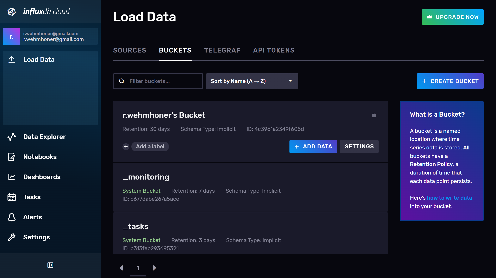
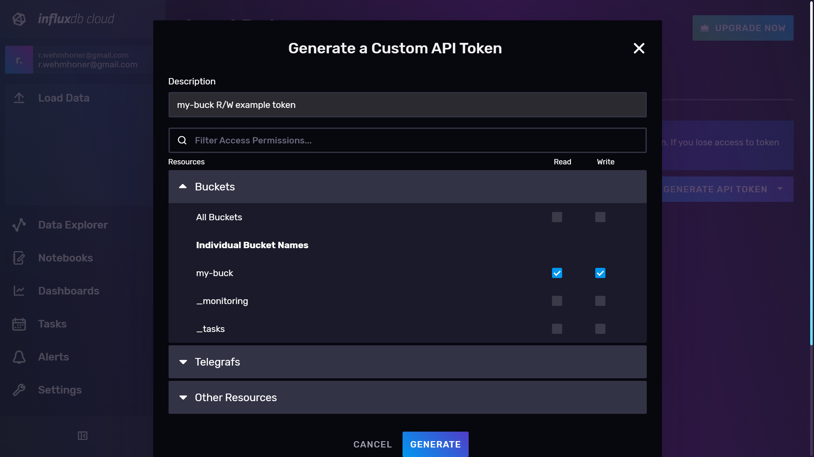

# TODOS

create tsconfig.json ?
best practices for API Tokens ?
Possible errors notes same as in iot center workshop

more abstract (how points looks etc.)

create repozitory with docker-compose and corresponding .ENV which can be started without any modifications

everything will be online on github for easier testing troubleshooting


# setup influxdb

## create cloud influxdb account OR use local OSS influxdb instalation

### Cloud setup
register cloud https://cloud2.influxdata.com/signup
(select closest provider ?)

*Cloud account has many advanateges over OSS version ... todo*

### Local setup with docker

You need to have [Docker](https://www.docker.com/) running

<details>
<summary>for fast init create `docker-compose.yml` containing:</summary>

```
version: "3"
services:
  influxdb_v2:
    image: influxdb:latest
    ports:
      - "8086:8086"
    environment:
      - INFLUXD_HTTP_BIND_ADDRESS=:8086
      - DOCKER_INFLUXDB_INIT_MODE=setup
      - DOCKER_INFLUXDB_INIT_USERNAME=my-user
      - DOCKER_INFLUXDB_INIT_PASSWORD=my-password
      - DOCKER_INFLUXDB_INIT_ORG=my-org
      - DOCKER_INFLUXDB_INIT_BUCKET=my-buck
      - DOCKER_INFLUXDB_INIT_RETENTION=30d
      - DOCKER_INFLUXDB_INIT_ADMIN_TOKEN=my-token
    command: influxd --reporting-disabled
```
</details>


and call `docker-compose up -d`

influx should be running on http://localhost:8086/ with login, password, bucket, token etc. defined inside docker-compose.yml (for details see [docker hub influxdb docs](https://hub.docker.com/_/influxdb))

*bucket and token is already created, so step where we will create them can be skipped*

### Local setup binaries

go to [inflxudb downloads page](https://portal.influxdata.com/downloads/), select your platform and install binaries. Then run server with `influxd`. **Note that server is running inside your terminal and will be shuted down if you close terminal window.**
Proceed through onboarding on http://localhost:8086/ and create your local account.

*binaries can differ in behaviour details, if you want to have smooth experience, create free **influxdb cloud account***


# Creating bucket

[Login](https://cloud2.influxdata.com/login) into your influxdb ui. 

Go to Load data tab -> buckets.


Click crete bucket. Name your bucket and click create. Remember your bucket name, it will be important later.

*Buckets are where data is stored in influxdb, its equivalent in sql are databases*


Next stay in Load data tab and go to API Tokens sub tab and click **Generate API Token**. Name your api token, check read and write for your created bucket and click **generate**.

Save your token somewhere safe. If you lost or publicate your token, you can always invalidate it and create new one.

*API Keys is like your login information into influx db but for your program. They have also definde privileges what your program can do and what cannot for safety reasons*

# exiting libraries

There are many [influxdb clients](https://docs.influxdata.com/influxdb/v1.8/tools/api_client_libraries/), which can be used to build and connect your application to influxdb. In this tutorial we will go through basics of javsctipt client but feel free to explore other clients too.

TODO: blogpost for other libraries here

# Javsript client examples

## preparing js environment

prerequizites
  [node.js](https://nodejs.org/en/)
  yarn (with `npm install -g yarn` if npm installed)


create package.json

yarn add @influxdata/influxdb-client
yarn add -D ts-node typescript @types/node dotenv

add 
```
  "scripts": {
    "start":"ts-node ./src/index.ts"
  },
```
<details>
<summary>package.json will look like this</summary>

```
{
  "scripts": {
    "start": "ts-node ./src/index.ts"
  },
  "dependencies": {
    "@influxdata/influxdb-client": "^1.23.0"
  },
  "devDependencies": {
    "@types/node": "^17.0.21",
    "dotenv": "^16.0.0",
    "ts-node": "^10.7.0",
    "typescript": "^4.6.2"
  }
}
```
</details>


Now we have prepared our influxdb bucket, and API Token. It's also good to have ui opened so we can explore data there too.

create .ENV file and fill up your information in it. 
```
INFLUX_URL=
INFLUX_TOKEN=
INFLUX_ORG=
INFLUX_BUCKET=
```
*You want to keep your token safe, so add .ENV into your .gitignore so you won't accidentaly commit it public*

*This file is used by library dotenv and simulates passing values by environment. Feel free to use envirnment values instead if you know how to use it.*


## Code

now we can create `index.ts` inside `src` directory and start adding code.

import and ensure all reuquired properties are set and create Influxdb object

```
import 'dotenv/config';
import { InfluxDB } from "@influxdata/influxdb-client";

const { INFLUX_URL, INFLUX_TOKEN, INFLUX_ORG, INFLUX_BUCKET, } = process.env;

if (!INFLUX_URL || !INFLUX_TOKEN || !INFLUX_ORG || !INFLUX_BUCKET) {
  process.stderr.write("Missing one or more environment values: INFLUX_URL, INFLUX_TOKEN, INFLUX_ORG, INFLUX_BUCKET\n")
  process.exit(1);
}

const db = new InfluxDB({ token: INFLUX_TOKEN, url: INFLUX_URL });
```


# TODO ->
Write point
Explain point structure
Advanced params for writing points
calculation limits for write ?
query
 - simple query explained (ui screenshots, first create query in ui then copy it into code)

  tagged template for custom arguments inside flux

  - advanced [query](https://github.com/influxdata/influxdb-client-js/blob/master/examples/query.ts) methods (queryRows)


agregations

line protocol example

telegraf mention

iot-center-v2 mention

